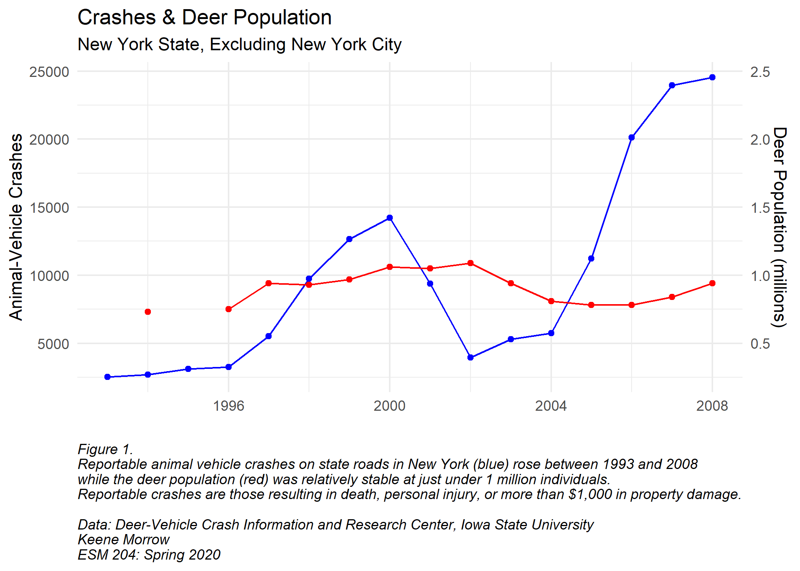

```{r setup, include=FALSE}
knitr::opts_chunk$set(echo = TRUE)

library(tidyverse)
library(janitor)

data <- read_csv("nys_drva.csv") %>%
  janitor::clean_names() %>%
  rename(av_crashes = animal_vehicle_crashes,
         pct = percent_animal_vehicle_crashes,
         deer_pop = post_hunt_deer_population_estimates,
         carc = salvaged_and_unsalvaged_deer_carcasses) %>%
  filter(year < 2009) # data after 2009 includes NYC

ggplot(data) +
  # animal vehicle crashed
  geom_line(aes(x = year,
                y = av_crashes),
            color = "blue") +
  geom_point(aes(x = year,
                y = av_crashes),
            color = "blue") +
  # deer population
  geom_line(aes(x = year,
                y = deer_pop / 100),
            color = "red") +
  geom_point(aes(x = year,
                y = deer_pop / 100),
            color = "red") +
  # scale wrangling
  scale_y_continuous(limits = c(min(data$av_crashes), max((data$av_crashes))), # keeps scales consistent across plots
                     sec.axis = sec_axis(~./10000, name = "Deer Population (millions)")) + # adds second axis for rainfall, adjusted to counteract the scale factor above
  labs(
    x = "",
    y = "Animal-Vehicle Crashes",
    title = "Crashes & Deer Population",
    subtitle = "New York State, Excluding New York City",
    caption = paste("Figure 1.\nReportable animal vehicle crashes on state roads in New York (blue) rose between 1993 and 2008\nwhile the deer population (red) was relatively stable at just under 1 million individuals.\nReportable crashes are those resulting in death, personal injury, or more than $1,000 in property damage.\n\nData: Deer-Vehicle Crash Information and Research Center, Iowa State University\nKeene Morrow\nESM 204: Spring 2020",
                    sep = "")) + 
  theme_minimal() +
  theme(plot.caption = element_text(hjust = 0, face = "italic"))

ggsave("figures/figure1.png", width = 7, height = 5)
```
### BACKGROUND

In `r data$year[4]` New York State's deer population following the hunting season was estimated to be `r as.character(data$deer_pop[4])`. Reportable animal-vehicle crashes totaled `r data$av_crashes[4]` that year, `r data$pct[4]`% of all crashes in New York State, excluding New York City.
(Reportable crashes are those resulting in death, personal injury, or more than \$1,000 in property damage.)
By `r data$year[16]` the deer population had grown to `r as.character(data$deer_pop[16])` individuals (a `r round(((data$deer_pop[16] - data$deer_pop[4])/data$deer_pop[4])*100, 2)`% change),  while reportable crashes had ballooned to `r data$av_crashes[16]`, a `r round(((data$av_crashes[16] - data$av_crashes[4])/data$av_crashes[4])*100, 2)`% change.
Animal-vehicles crashes accounted for `r data$pct[16]`% of all reportable crashes in `r data$year[16]`. (Figure 1, ISU DVCIR)




### AVAILABLE INTERVENTIONS


***
### REFERENCES

"State Animal-Vehicle Crash Fatality Data: New York" Deer-Vehicle Crash Information and Research Center, Iowa State University. https://iowaltap.iastate.edu/animal-vehicle-crash-fatality-data/
